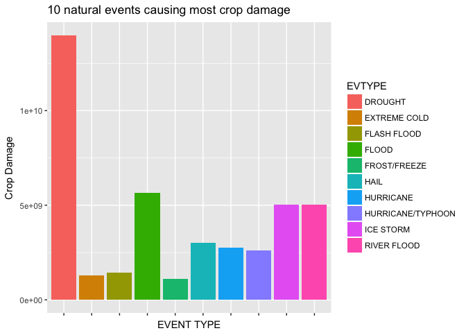

Introduction
------------

We analyzed natural events datafrom he U.S. National Oceanic and
Atmospheric Administration’s (NOAA) storm database to determine what are
the most harmful events in terms of fatatilies and property damage,
using different techniques and presenting the information comparatively.

Data processing
---------------

First, we need to download data and load it into R as a data frame.

    download.file("https://d396qusza40orc.cloudfront.net/repdata%2Fdata%2FStormData.csv.bz2","StormData.csv.bz2")

    StormData<-read.csv("StormData.csv.bz2")

    head(StormData)

    ##   STATE__           BGN_DATE BGN_TIME TIME_ZONE COUNTY COUNTYNAME STATE
    ## 1       1  4/18/1950 0:00:00     0130       CST     97     MOBILE    AL
    ## 2       1  4/18/1950 0:00:00     0145       CST      3    BALDWIN    AL
    ## 3       1  2/20/1951 0:00:00     1600       CST     57    FAYETTE    AL
    ## 4       1   6/8/1951 0:00:00     0900       CST     89    MADISON    AL
    ## 5       1 11/15/1951 0:00:00     1500       CST     43    CULLMAN    AL
    ## 6       1 11/15/1951 0:00:00     2000       CST     77 LAUDERDALE    AL
    ##    EVTYPE BGN_RANGE BGN_AZI BGN_LOCATI END_DATE END_TIME COUNTY_END
    ## 1 TORNADO         0                                               0
    ## 2 TORNADO         0                                               0
    ## 3 TORNADO         0                                               0
    ## 4 TORNADO         0                                               0
    ## 5 TORNADO         0                                               0
    ## 6 TORNADO         0                                               0
    ##   COUNTYENDN END_RANGE END_AZI END_LOCATI LENGTH WIDTH F MAG FATALITIES
    ## 1         NA         0                      14.0   100 3   0          0
    ## 2         NA         0                       2.0   150 2   0          0
    ## 3         NA         0                       0.1   123 2   0          0
    ## 4         NA         0                       0.0   100 2   0          0
    ## 5         NA         0                       0.0   150 2   0          0
    ## 6         NA         0                       1.5   177 2   0          0
    ##   INJURIES PROPDMG PROPDMGEXP CROPDMG CROPDMGEXP WFO STATEOFFIC ZONENAMES
    ## 1       15    25.0          K       0                                    
    ## 2        0     2.5          K       0                                    
    ## 3        2    25.0          K       0                                    
    ## 4        2     2.5          K       0                                    
    ## 5        2     2.5          K       0                                    
    ## 6        6     2.5          K       0                                    
    ##   LATITUDE LONGITUDE LATITUDE_E LONGITUDE_ REMARKS REFNUM
    ## 1     3040      8812       3051       8806              1
    ## 2     3042      8755          0          0              2
    ## 3     3340      8742          0          0              3
    ## 4     3458      8626          0          0              4
    ## 5     3412      8642          0          0              5
    ## 6     3450      8748          0          0              6

Most harmful events to human health
-----------------------------------

This data set account data for four types of damage: fatality
(FATALITIES) , injury (INJURIES), property damage (PROPDMG) and crop
damage (CROPDMG). The two first items are directly related to human
health, so a summary is presented.

    library(dplyr)

    ## 
    ## Attaching package: 'dplyr'

    ## The following objects are masked from 'package:stats':
    ## 
    ##     filter, lag

    ## The following objects are masked from 'package:base':
    ## 
    ##     intersect, setdiff, setequal, union

    Events <- summarise(group_by(StormData,EVTYPE), sum(INJURIES), sum(FATALITIES))
    names(Events) <- c("EVTYPE","INJURIES","FATALITIES")
    Events <- as.data.frame(Events)

We order the events by the total number of injuries

    Injuries_ordered <- Events[order(Events$INJURIES, decreasing = TRUE), c("EVTYPE","INJURIES")]

    head(Injuries_ordered,10)

    ##                EVTYPE INJURIES
    ## 834           TORNADO    91346
    ## 856         TSTM WIND     6957
    ## 170             FLOOD     6789
    ## 130    EXCESSIVE HEAT     6525
    ## 464         LIGHTNING     5230
    ## 275              HEAT     2100
    ## 427         ICE STORM     1975
    ## 153       FLASH FLOOD     1777
    ## 760 THUNDERSTORM WIND     1488
    ## 244              HAIL     1361

We then order the events by the total number of fatalities

    Fatalities_ordered <- Events[order(Events$FATALITIES, decreasing = TRUE), c("EVTYPE","FATALITIES")]

    head(Fatalities_ordered,10)

    ##             EVTYPE FATALITIES
    ## 834        TORNADO       5633
    ## 130 EXCESSIVE HEAT       1903
    ## 153    FLASH FLOOD        978
    ## 275           HEAT        937
    ## 464      LIGHTNING        816
    ## 856      TSTM WIND        504
    ## 170          FLOOD        470
    ## 585    RIP CURRENT        368
    ## 359      HIGH WIND        248
    ## 19       AVALANCHE        224

The 10 natural events causing most fatalities are shown in the following
plot

    library(ggplot2)
    ggplot(Fatalities_ordered[1:10,], aes(EVTYPE,FATALITIES,fill=EVTYPE))+geom_bar(stat = "identity")+theme(axis.text.x =element_blank())+xlab('EVENT TYPE')+ggtitle("10 natural events causing most fatalities")

The 10 natural events causing most injuries are shown in the following
plot

    ggplot(Injuries_ordered[1:10,], aes(EVTYPE,INJURIES,fill=EVTYPE))+geom_bar(stat = "identity")+theme(axis.text.x =element_blank())+xlab('EVENT TYPE')+ggtitle("10 natural events causing most injuries")

We will determine which events cause BOTH major fatalities and body
injuries.

    intersect(Injuries_ordered[1:10, 1], Fatalities_ordered[1:10, 1])

    ## [1] "TORNADO"        "TSTM WIND"      "FLOOD"          "EXCESSIVE HEAT"
    ## [5] "LIGHTNING"      "HEAT"           "FLASH FLOOD"

Most harmful events to economic
-------------------------------

Here we summarize property and crop damage cause by these natural
events.

    unique(StormData$PROPDMGEXP)

    ##  [1] K M   B m + 0 5 6 ? 4 2 3 h 7 H - 1 8
    ## Levels:  - ? + 0 1 2 3 4 5 6 7 8 B h H K m M

    unique(StormData$CROPDMGEXP)

    ## [1]   M K m B ? 0 k 2
    ## Levels:  ? 0 2 B k K m M

There are several conventions to easy figure reading and calculations:
“K” stands for thousands, “M” for millions and “B” for billions. We need
to standarize the upper and lower case from those. First, we transform
exponential values to actual numbers.

    StormData[StormData$PROPDMGEXP == "K", ]$PROPDMG <- StormData[StormData$PROPDMGEXP == "K", ]$PROPDMG * 1000

    StormData[StormData$PROPDMGEXP == "M", ]$PROPDMG <- StormData[StormData$PROPDMGEXP == "M", ]$PROPDMG * 1e+06

    StormData[StormData$PROPDMGEXP == "m", ]$PROPDMG <- StormData[StormData$PROPDMGEXP == "m", ]$PROPDMG * 1e+06

    StormData[StormData$PROPDMGEXP == "B", ]$PROPDMG <- StormData[StormData$PROPDMGEXP == "B", ]$PROPDMG *  1e+09

    StormData[StormData$CROPDMGEXP == "K", ]$CROPDMG <- StormData[StormData$CROPDMGEXP == "K", ]$CROPDMG * 1000

    StormData[StormData$CROPDMGEXP == "k", ]$CROPDMG <- StormData[StormData$CROPDMGEXP == "k", ]$CROPDMG * 1000

    StormData[StormData$CROPDMGEXP == "M", ]$CROPDMG <- StormData[StormData$CROPDMGEXP == "M", ]$CROPDMG * 1e+06

    StormData[StormData$CROPDMGEXP == "m", ]$CROPDMG <- StormData[StormData$CROPDMGEXP == "m", ]$CROPDMG * 1e+06

    StormData[StormData$CROPDMGEXP == "B", ]$CROPDMG <- StormData[StormData$CROPDMGEXP == "B", ]$CROPDMG * 1e+09

    Events2 <- summarise(group_by(StormData,EVTYPE), sum(PROPDMG), sum(CROPDMG))
    names(Events2)<-c("EVTYPE","PROPDMG","CROPDMG")
    Events2 <- as.data.frame(Events2)

We order the events by the total number of property damage

    PROPDMG_ordered <- Events2[order(Events2$PROPDMG, decreasing = TRUE),c("EVTYPE","PROPDMG")]

We order the events by the total number of crop damage

    CROPDMG_ordered <- Events2[order(Events2$CROPDMG, decreasing = TRUE),c("EVTYPE","CROPDMG")]

The 10 natural events causing most property damage are shown in the
following plot

    ggplot(PROPDMG_ordered[1:10,], aes(EVTYPE,PROPDMG,fill=EVTYPE))+geom_bar(stat = "identity")+theme(axis.text.x =element_blank())+xlab('EVENT TYPE')+ylab("Property Damage")+ggtitle("10 natural events causing most property damage")

We notice that flood cause the most property damage.

The 10 natural events causing most crop damage are shown in the
following plot

    ggplot(CROPDMG_ordered[1:10,], aes(EVTYPE,CROPDMG,fill=EVTYPE))+geom_bar(stat = "identity")+theme(axis.text.x =element_blank())+xlab('EVENT TYPE')+ylab("Crop Damage")+ggtitle("10 natural events causing most crop damage")

We notice that drought cause the most crop damage.

We see the sequence of these two types of damages is different. We will
add them to obtain the total sum.

    Events2$Total <- Events2$PROPDMG + Events2$CROPDMG
    head(Events2[order(Events2$Total, decreasing = TRUE),],10)

    ##                EVTYPE      PROPDMG     CROPDMG        Total
    ## 170             FLOOD 144657709807  5661968450 150319678257
    ## 411 HURRICANE/TYPHOON  69305840000  2607872800  71913712800
    ## 834           TORNADO  56937160779   414953270  57352114049
    ## 670       STORM SURGE  43323536000        5000  43323541000
    ## 244              HAIL  15732267048  3025954473  18758221521
    ## 153       FLASH FLOOD  16140812067  1421317100  17562129167
    ## 95            DROUGHT   1046106000 13972566000  15018672000
    ## 402         HURRICANE  11868319010  2741910000  14610229010
    ## 590       RIVER FLOOD   5118945500  5029459000  10148404500
    ## 427         ICE STORM   3944927860  5022113500   8967041360
